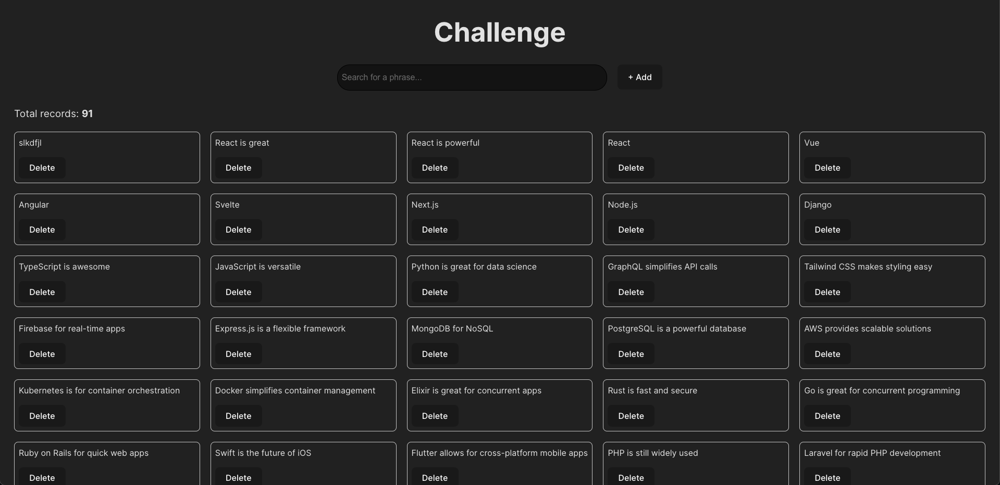
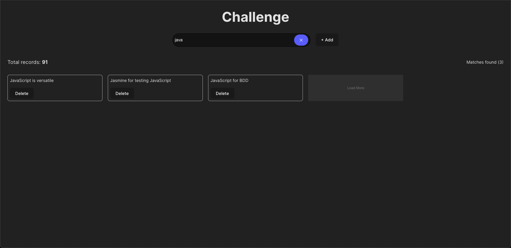
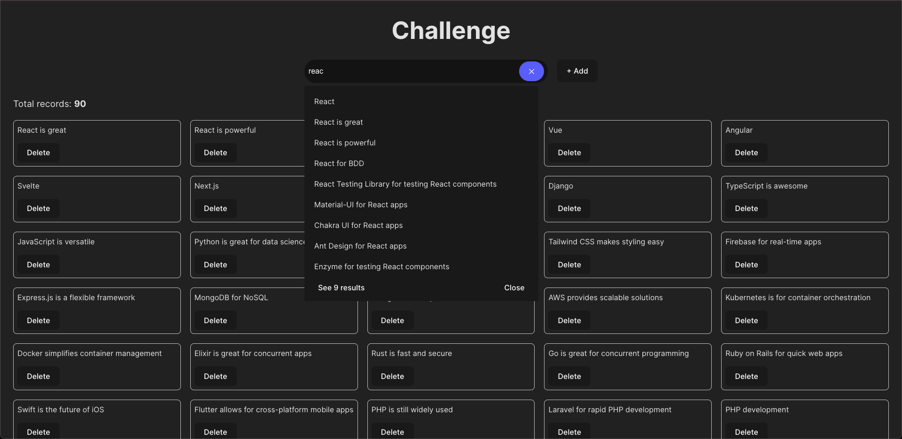
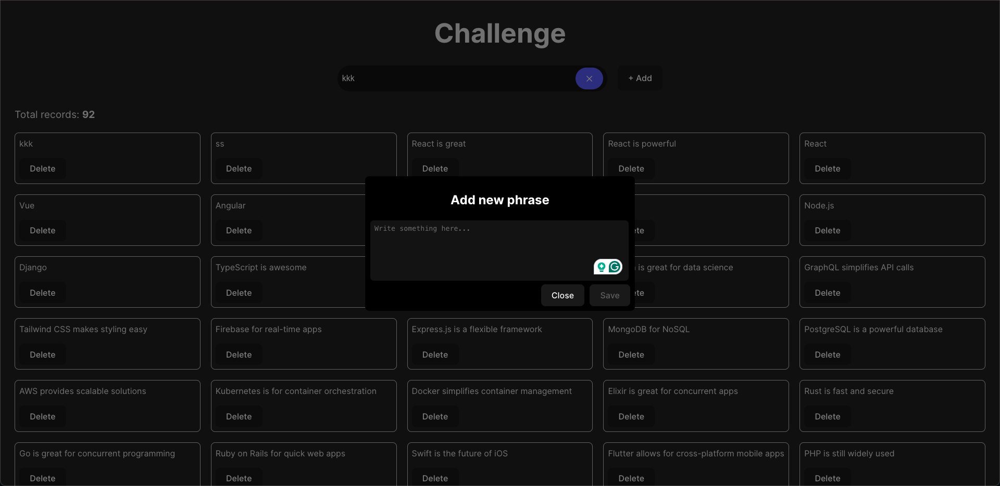

# Challenge of phrases.

### Project Objective

The goal of this project is to create a "Challenge" that allows users to visualize, add, and delete phrases. The phrases will be displayed in a matrix of cards, and users will be able to interact with them easily.

#### Main Features:

- Add Phrases: Users can add new phrases.
- Remove Phrases: Users can remove existing phrases.
- Visualization in a Grid: The phrases are displayed in a card format in the interface.
- Search: Users can search for specific phrases using a search bar.

#### Screenshots preview






## 1. Project Installation

### Step 1: install dependencies

First, you need to have **Node.js** installed on your machine. If you haven't installed it yet, you can download it from [here](https://nodejs.org/).

- Also we recommend to use [Nvm](https://github.com/nvm-sh/nvm) to handle multiple node versions.

Then, run the following command in your terminal to create a new Vite project with React:

```bash
git clone https://github.com/expirales/examen-sooft-tec.git
```

Then to install dependencies execute the following lines:

```bash
cd examen-sooft-tec
npm install
```

To run de project in `dev` mode:

```bash
npm run dev

the app is gonna run on http://localhost:5173/
```

#### Third-Party Libraries Used:

- [Fuse.js](https://fusejs.io/): A library used to perform fuzzy searches within the added phrases. It allows users to search for phrases even if they don't remember the exact spelling.
- [React Router](https://reactrouter.com/): A user‑obsessed, standards‑focused, multi‑strategy router you can deploy anywhere.

#### Technologies and Versions

`Technologies Used:`

- [Vite](https://vite.dev/guide/): Used as a fast development bundler.
- [React](https://es.react.dev/): A library for building the user interface.
- [Sass](https://sass-lang.com/): Used for styling the application.
- [Fuse.js](https://fusejs.io/): For fuzzy search functionality.
- [Jest](https://jestjs.io/): Jest is a delightful JavaScript Testing Framework with a focus on simplicity.
- [Husky](https://typicode.github.io/husky/): Automatically lint your commit messages, code, and run tests upon committing or pushing.

##### Versions:

```bash
"fuse.js": "^7.1.0",
"react": "^19.0.0",
"react-dom": "^19.0.0",
"react-router-dom": "^7.1.5",
"sass": "^1.84.0"
```

### Step 2: launch prod env

To build a distro version for prod you need to run the following command:

- A `dist` folder is going to be create in your root folder. Inside we find all the files ready for deploy to prod.

```bash
npm run build
```
